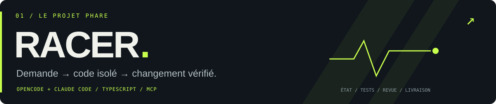

<a href="README.md">English</a> · <strong>Français</strong>

  <strong>Antonu-Maria Mela</strong> · Responsable technique &amp; architecte logiciel 
  Je conçois des outils de développement agentiques, des produits enrichis par l’IA et des systèmes de données, depuis la Corse.

  <a href="https://github.com/heavnzor/heavnz0r-racer/blob/main/README.fr.md">Racer</a> &nbsp; / &nbsp;
  <a href="https://github.com/heavnzor/heavnz0r-crashlab/blob/main/README.fr.md">CrashLab</a> &nbsp; / &nbsp;
  <a href="https://github.com/heavnzor/heavnz0r-proofmill/blob/main/README.fr.md">ProofMill</a> &nbsp; / &nbsp;
  <a href="https://linkedin.com/in/anto-mela">LinkedIn</a>

---

## 01 / Le projet phare

**[heavnz0r'Racer ↗](https://github.com/heavnzor/heavnz0r-racer/blob/main/README.fr.md)** — Un workflow de développement quotidien pour **OpenCode + Claude Code**. Répertoires de travail Git isolés, critères d’acceptation exécutables, revue indépendante et historique des vérifications permettant de reprendre une mission interrompue.

`demande → exploration → plan → développement → vérification → revue → livraison`

**TypeScript · MCP · Git · SQLite** &nbsp; · &nbsp; [Lancer la démo](https://github.com/heavnzor/heavnz0r-racer/blob/main/README.fr.md#démarrage-rapide) &nbsp; · &nbsp; [Architecture détaillée — EN](https://github.com/heavnzor/heavnz0r-racer/blob/main/docs/architecture.md)

## 02 / Éprouver et expliquer

**[heavnz0r'CrashLab ↗](https://github.com/heavnzor/heavnz0r-crashlab/blob/main/README.fr.md)** — Injecter des pannes ambiguës dans les outils. Observer leurs effets. Reproduire le contre-exemple. Un laboratoire de défaillances pour agents, avec **simulation MCP, scénarios d’idempotence, vérification d’invariants et rejeu déterministe des actions**.

**TypeScript · JSON Schema · MCP · Rapports pour l’intégration continue**

**[heavnz0r'ProofMill ↗](https://github.com/heavnzor/heavnz0r-proofmill/blob/main/README.fr.md)** — Vos données ont changé. Votre recette de nettoyage aussi. Exécutez les quatre combinaisons, distinguez leurs effets et remontez jusqu’aux enregistrements sources. **Recettes proposées par l’IA, exécution déterministe, calcul décimal, exports Parquet et dossiers de preuves.**

**Python · DuckDB · Pydantic · MCP**

Trois outils open source en version initiale. Des démos exécutables, un périmètre explicite et des résultats vérifiables.

---

## 03 / IA appliquée et marchés

**BitBot AI** · **Privé**

Bot autonome de trading intrajournalier de cryptomonnaies sur les contrats perpétuels du DEX Hyperliquid. Architecture hybride : un moteur d’analyse technique classique — RSI, MACD, bandes de Bollinger, ATR — génère les signaux ; l’analyse multi-modèle de Claude — Opus, Sonnet, Haiku — les filtre et les confirme. **Python · asyncio · aiosqlite.**

**[Polymarket Trading Bot ↗](https://github.com/heavnzor/polymarket-trading-bot/blob/main/README.fr.md)** · **Public**

Bot de marchés prédictifs enrichi par l’IA, avec analyse multi-agent Claude. Recherche automatisée, évaluation des probabilités et exécution sur Polymarket.

**Binance ROI Predictor** · **Privé**

Modèle d’ensemble combinant ARIMA, régression linéaire et LSTM pour prédire les 50 paires USDT présentant le meilleur potentiel de retour sur investissement.

## 04 / Derrière les outils

**Responsable technique & architecte logiciel chez [Upikajob](https://upikajob.com)** · Depuis 2023

Architecture et développement d’un SaaS RH B2B intégrant l’IA : entretiens conversationnels avec mémoire, systèmes multi-clients en marque blanche, signaux en temps réel, intégrations SIRH/ATS et chaînes de traitement pour le reporting.

J’interviens sur l’ensemble du système : **architecture produit, développement, données, exploitation cloud, revue de code et accompagnement des développeurs**. Plus de vingt ans à construire des logiciels, des premiers produits web aux applications enrichies par l’IA.

| Domaine | Outils utilisés |
|---|---|
| **Systèmes et API** | PHP · Symfony · Python · TypeScript · Node.js |
| **IA et agents** | Azure OpenAI · Claude · MCP · RAG · Workflows agentiques |
| **Données** | SQL · MySQL / MariaDB · SQLite · DuckDB · Reporting |
| **Mise en production** | Azure · Docker · GitHub Actions · Git · Observabilité |

<strong>Quelques repères dans mon parcours</strong>

- **2003** — Création et vente d’une plateforme de diffusion vidéo à 14 ans.
- **2011–2022** — Développement full-stack indépendant dans les RH, le commerce, l’immobilier, l’éducation et les services juridiques.
- **2022–2024** — Stratégie numérique et performance web pour une étude notariale.
- **Depuis 2023** — Direction technique du développement et architecture chez Upikajob.
- **Aujourd’hui** — Ingénierie agentique, workflows reproductibles et systèmes de données assistés par l’IA.

---

<strong>Un bon système permet de comprendre son comportement.</strong> 
<a href="https://linkedin.com/in/anto-mela">LinkedIn</a> &nbsp; · &nbsp;
<a href="mailto:anto.mela@me.com">E-mail</a> &nbsp; · &nbsp; Corse, France

Ouvert aux opportunités d’Engineering Manager et de Lead / Staff Engineer · À distance ou en hybride en Europe

