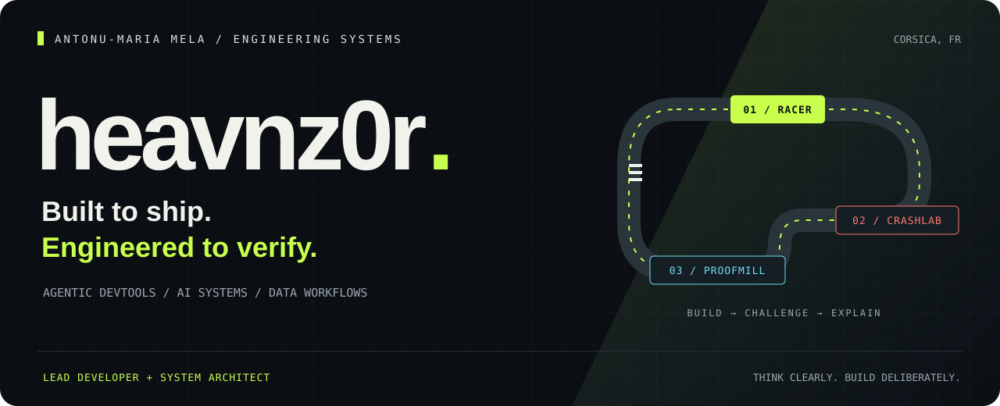
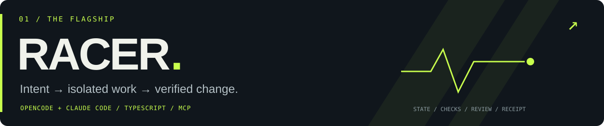

  <strong>Antonu-Maria Mela</strong> · Lead Developer &amp; System Architect 
  Building agentic developer tools, AI-augmented products, and data systems from Corsica.

  <a href="https://github.com/heavnzor/heavnz0r-racer">Racer</a> &nbsp; / &nbsp;
  <a href="https://github.com/heavnzor/heavnz0r-crashlab">CrashLab</a> &nbsp; / &nbsp;
  <a href="https://github.com/heavnzor/heavnz0r-proofmill">ProofMill</a> &nbsp; / &nbsp;
  <a href="https://linkedin.com/in/anto-mela">LinkedIn</a>

---

## 01 / The flagship

**[heavnz0r'Racer ↗](https://github.com/heavnzor/heavnz0r-racer)** — A daily development workflow for **OpenCode + Claude Code**. Isolated worktrees, executable acceptance criteria, independent review, and a resumable evidence trail.

`brief → recon → plan → build → verify → review → handoff`

**TypeScript · MCP · Git · SQLite** &nbsp; · &nbsp; [Run the demo](https://github.com/heavnzor/heavnz0r-racer#start-your-engine) &nbsp; · &nbsp; [Read the architecture](https://github.com/heavnzor/heavnz0r-racer/blob/main/docs/architecture.md)

## 02 / Challenge & explain

**[heavnz0r'CrashLab ↗](https://github.com/heavnzor/heavnz0r-crashlab)** — Inject ambiguous tool failures. Inspect the effects. Reproduce the counterexample. An agent fault laboratory with **MCP simulation, idempotency scenarios, invariant checks, and deterministic action replay**.

**TypeScript · JSON Schema · MCP · CI reports**

**[heavnz0r'ProofMill ↗](https://github.com/heavnzor/heavnz0r-proofmill)** — Your data changed. Your cleaning recipe changed too. Run all four combinations, separate their effects, and trace the result back to source records. **AI-proposed recipes, deterministic execution, decimal arithmetic, Parquet receipts.**

**Python · DuckDB · Pydantic · MCP**

Three early-stage open-source tools. Runnable demos, explicit boundaries, and inspectable evidence.

---

## 03 / Applied AI & markets

**BitBot AI** · **Private**

Autonomous crypto day-trading bot on Hyperliquid DEX perpetual futures. Hybrid architecture: classical TA engine — RSI, MACD, Bollinger, ATR — generates signals; Claude multi-model analysis — Opus, Sonnet, Haiku — filters and confirms. **Python · asyncio · aiosqlite.**

**[Polymarket Trading Bot ↗](https://github.com/heavnzor/polymarket-trading-bot)** · **Public**

AI-powered prediction market bot with multi-agent Claude analysis. Automated research, odds evaluation, and execution on Polymarket.

**Binance ROI Predictor** · **Private**

ARIMA + Linear Regression + LSTM ensemble model to predict top-50 USDT trading pairs by ROI potential.

## 04 / Behind the tools

**Lead Developer & System Architect @ [Upikajob](https://upikajob.com)** · 2023–present

Architecture and delivery of an AI-powered B2B HR SaaS: conversational interviews with memory, multi-tenant white-label systems, real-time signals, HRIS/ATS integrations, and reporting pipelines.

I work across the system: **product architecture, implementation, data, cloud operations, code review, and mentoring**. More than twenty years building software, from early web products to AI-augmented applications.

| Layer | Tools I work with |
|---|---|
| **Systems & APIs** | PHP · Symfony · Python · TypeScript · Node.js |
| **AI & agents** | Azure OpenAI · Claude · MCP · RAG · Agent workflows |
| **Data** | SQL · MySQL / MariaDB · SQLite · DuckDB · Reporting |
| **Delivery** | Azure · Docker · GitHub Actions · Git · Observability |

<strong>A little more background</strong>

- **2003** — Built and sold a video-streaming platform at age 14.
- **2011–2022** — Independent full-stack development across HR, commerce, real estate, education and legal services.
- **2022–2024** — Digital strategy and web performance for a notary firm.
- **2023–present** — Lead development and architecture at Upikajob.
- **Current focus** — Agentic engineering, reproducible workflows, and AI-assisted data systems.

---

<strong>Good systems make their behavior understandable.</strong> 
<a href="https://linkedin.com/in/anto-mela">LinkedIn</a> &nbsp; · &nbsp;
<a href="mailto:anto.mela@me.com">Email</a> &nbsp; · &nbsp; Corsica, France

Open to Engineering Manager and Lead / Staff Engineer opportunities · Remote or hybrid in Europe

